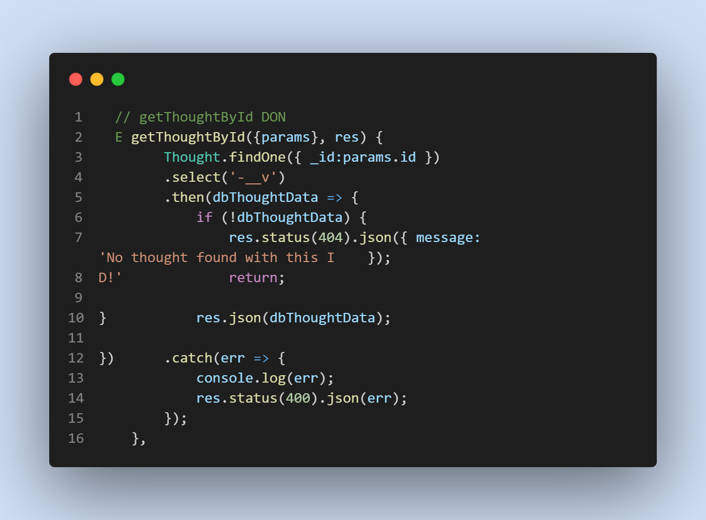
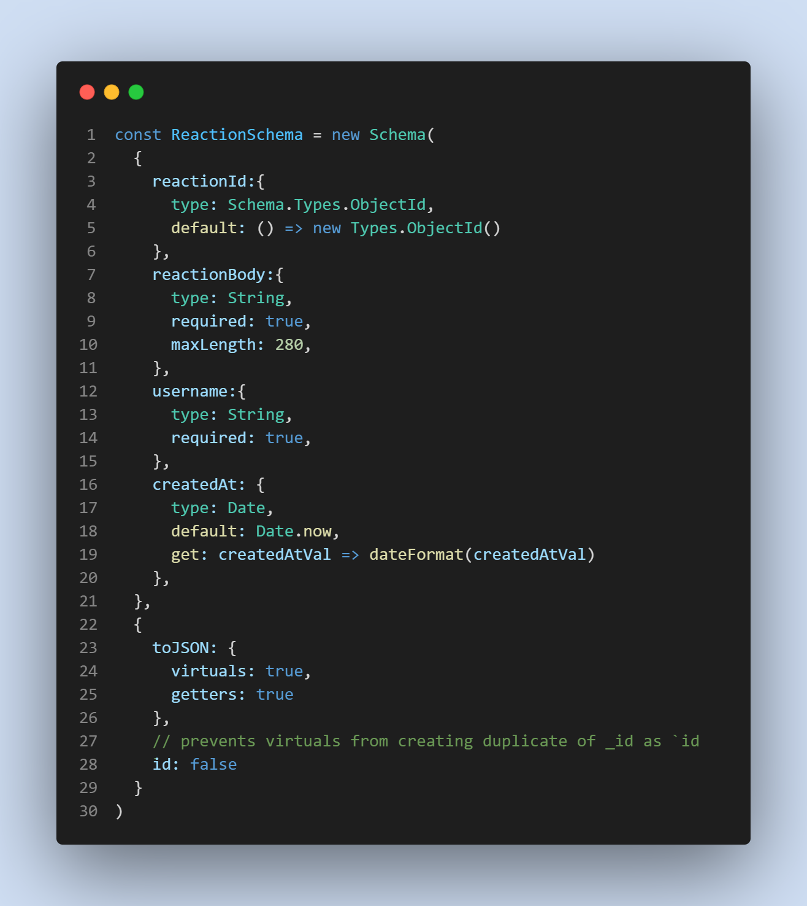

# Social Network-API

* [Users Video](https://drive.google.com/file/d/1kvgETFLLmDaxdkcT22y-CqNWwpO99DD8/view)

* [Thoughts Video](https://drive.google.com/file/d/1TnuNTNk4e1uBH0lk-l_mQRJkEks6f2lW/view)

* [Reactions Video](https://drive.google.com/file/d/1HMlkYxYxtujsndsKbwSnxl5L5MSrfJjl/view)

### Insomnia:
.png)

## Description

 * MongoDB is a popular choice for Social Networks due to its speed with large amounts of data and flexibility. 
 * Building an API for a social network web application is where user can share their thoughts, reactions toa  friends thoughts and creating a friend list.
 * Use of date now is used as well as a Utils helper considering the sophistication of the application for accurate formatting and time stamps.

# Table of contents
1. [Technologies used](#techologies-used)
2. [Features](#features)
3. [Usage](#usage)
4. [Credits](#credits)
5. [License](#license)

## Technologies used
* Javascript
* Mongoose
* Express
* Node
* Insomnia

## Features
* GET all users
* GET a single user by its _id and populated thought and friend data
* POST a new user
* PUT to update a user by its _id
* DELETE to remove user by its _id

## Usage
* Installing necessary dependencies including Express, and Mongoose 
* For developers, run nodemon server.js.

* Screenshots:

## Credits

* [Travis Nichols](https://github.com/travnichols916/Social-Network-API)

## License
[MIT License](https://choosealicense.com/licenses/mit/)

